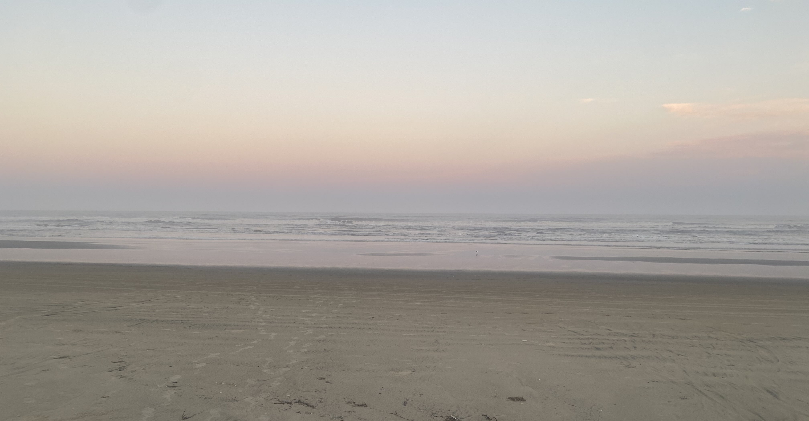

<h1></h1>

I'm a Computer technician and a Systems Analysis and Development student at PUCPR, I've been working in technology for 3 years of experience, focusing on code standards and systems development, using technologies such as Django, React Native, React, and Node. Currently, I work as a Software Developer at Klutch, focusing on development of sites, landing pages and corrections of platforms.

  
  

